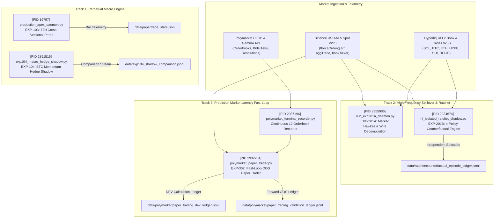

# Unified Trading Experiment Architecture & Live Tracking Specification

**Document Version:** `v1.0.0-PROD-CONSOLIDATED`  
**Certification Standard:** `A0_CONF_20260930_V321_HARDENED`  
**Host Environment:** Tokyo GCP Production Instance (`asia-northeast1`)  
**Timestamp:** `2026-09-30T03:42:00Z`  
**Primary Target Milestone:** `2026-10-01T12:00:00Z` (Macro Checkpoint)

---

## 1. Executive System Topology & Daemon Map

The system runs **six independent asynchronous daemons** simultaneously on the Tokyo production host. They operate on separate event loops, log destinations, and state ledgers to guarantee zero cross-process state contamination.



### Active Production Daemon Inventory

| Track | PID | Executable Script | State & Ledger Files | Primary Log File | Cadence / Trigger |
| :--- | :---: | :--- | :--- | :--- | :--- |
| **Track 1** | `16797` | [`src/execution/production_apex_daemon.py`](file:///home/skybullet1987/quant_pipeline/src/execution/production_apex_daemon.py) | [`data/papertrade_state.json`](file:///home/skybullet1987/quant_pipeline/data/papertrade_state.json)<br>[`data/papertrade_journal.jsonl`](file:///home/skybullet1987/quant_pipeline/data/papertrade_journal.jsonl) | `logs/papertrade_monitor.log` | 4-Hour Micro-Bars (18 bars = 72H Macro) |
| **Track 1S** | `2851516` | [`src/execution/exp104_macro_hedge_shadow.py`](file:///home/skybullet1987/quant_pipeline/src/execution/exp104_macro_hedge_shadow.py) | [`data/exp104_shadow_state.json`](file:///home/skybullet1987/quant_pipeline/data/exp104_shadow_state.json)<br>[`data/exp104_shadow_comparison.jsonl`](file:///home/skybullet1987/quant_pipeline/data/exp104_shadow_comparison.jsonl) | [`data/exp104_shadow.log`](file:///home/skybullet1987/quant_pipeline/data/exp104_shadow.log) | 60-Second Loop (Polls BTC 1H Momentum) |
| **Track 2** | `2934674` | [`src/hl_leadlag/execution/hl_isolated_ratchet_shadow.py`](file:///home/skybullet1987/quant_pipeline/src/hl_leadlag/execution/hl_isolated_ratchet_shadow.py) | [`data/ratchet/counterfactual_episode_ledger.jsonl`](file:///home/skybullet1987/quant_pipeline/data/ratchet/counterfactual_episode_ledger.jsonl)<br>[`data/ratchet/ratchet_shadow_summary.json`](file:///home/skybullet1987/quant_pipeline/data/ratchet/ratchet_shadow_summary.json) | [`data/ratchet/ratchet_shadow.log`](file:///home/skybullet1987/quant_pipeline/data/ratchet/ratchet_shadow.log) | Exogenous Binance Liquidation Sweep ($\ge \$1\text{M}$) |
| **Track 2T** | `3355986` | [`src/hl_leadlag/market_data/run_exp201a_daemon.py`](file:///home/skybullet1987/quant_pipeline/src/hl_leadlag/market_data/run_exp201a_daemon.py) | [`data/exp201/spillover_events.parquet`](file:///home/skybullet1987/quant_pipeline/data/exp201/spillover_events.parquet) | `data/exp201/telemetry.log` | Sub-millisecond tick events via WebSockets |
| **Track 3D** | `2037196` | [`src/polymarket_research/polymarket_terminal_recorder.py`](file:///home/skybullet1987/quant_pipeline/src/polymarket_research/polymarket_terminal_recorder.py) | [`data/polymarket/polymarket_hourly_telemetry.jsonl`](file:///home/skybullet1987/quant_pipeline/data/polymarket/polymarket_hourly_telemetry.jsonl) | [`data/polymarket/recorder.log`](file:///home/skybullet1987/quant_pipeline/data/polymarket/recorder.log) | Continuous 1000ms Polymarket order book polling |
| **Track 3** | `2932204` | [`src/polymarket_research/polymarket_paper_trader.py`](file:///home/skybullet1987/quant_pipeline/src/polymarket_research/polymarket_paper_trader.py) | [`data/polymarket/paper_trader_state.json`](file:///home/skybullet1987/quant_pipeline/data/polymarket/paper_trader_state.json)<br>[`data/polymarket/paper_trading_validation_ledger.jsonl`](file:///home/skybullet1987/quant_pipeline/data/polymarket/paper_trading_validation_ledger.jsonl) | [`data/polymarket/paper_trader.log`](file:///home/skybullet1987/quant_pipeline/data/polymarket/paper_trader.log) | Continuous Binance BTC-USDT vs Polymarket CLOB |

---

## 2. Strategic Track Profiles & Microstructure Models

### Track 1: Core APEX Sovereign Perpetual Engine (`EXP-103` & `EXP-104`)

* **Economic Thesis**: Exploits structural cross-sectional funding rate premia across 16 Hyperliquid perpetuals while remaining market-beta neutral. Positions are held across 72-hour macro cycles with rebalances executed exclusively via Post-Only (ALO) passive limit orders to eliminate taker crossing costs and earn liquidity rebates.
* **Portfolio Allocation (Current Bar 9/18)**:
  * **Long Basket (+16.57% notional each)**: `HBAR`, `SUI`, `GRAM`, `OP`, `ETH`, `PYTH`, `GRASS`, `AERO`
  * **Short Basket (-16.57% notional each)**: `kBONK`, `kPEPE`, `PONS`, `NIL`, `PENGU`, `MORPHO`, `ALT`, `BNB`
* **Risk & Defense Layer (Grossman-Zhou)**:
  * Operational Floor: $F_{\text{operational}} = \$552.55\text{ USDC}$
  * Maximum Strategy Drawdown: 10.0% from historical High-Water Mark ($HWM = \$642.10\text{ USDC}$)
  * Pre-Trade Gate: Rejects any order where estimated post-trade worst-case equity $W_{\text{post,worst}} < F_{\text{operational}}$
* **EXP-104 Momentum Shadow**:
  * Monitors 1-hour BTC momentum ($\Delta p_{\text{BTC}, 1\text{h}}$).
  * If $\Delta p_{\text{BTC}, 1\text{h}} < -2.0\%$, opens a synthetic BTC short perp hedge to insulate the altcoin basket against correlated macro selloffs. Currently inactive ($\Delta p = -0.008\%$).

---

### Track 2: Hyperliquid Isolated Liquidation Ratchet (`EXP-201B` & `EXP-201A`)

* **Economic Thesis**: Massive liquidation cascades on Binance USD-M trigger forced market liquidations that propagate cross-venue to Hyperliquid altcoin order books. Because Hyperliquid market participants take 100–800ms to react, a low-latency sprint captures the directional dislocation before mean-reversion.
* **Counterfactual Policy Architecture (Institutional P0 Gate)**:
  To eliminate selection bias and ensure Order Book Imbalance (OBI) routing delivers authentic alpha over passive market drift, every liquidation episode evaluates four simultaneous counterfactual policy paths:
  1. $\mathcal{P}_{\text{SOL}}$: Fixed benchmark asset (`SOL_only`)
  2. $\mathcal{P}_{\text{RND}}$: Deterministic pseudo-random control (`RANDOM_eligible`, seeded by `episode_index`)
  3. $\mathcal{P}_{\text{RR}}$: Systematic cyclic baseline (`ROUND_ROBIN`, round-robin modulo asset list)
  4. $\mathcal{P}_{\text{OBI}}$: Production candidate (`MAX_OBI_router`, selects highest bid-ask imbalance)
* **Econometric Telemetry (EXP-201A)**:
  * Decomposes wire timestamps: $T_{\text{Binance}}$ (exchange trade match), $E_{\text{Binance}}$ (gateway push), $t_{\text{recv}}$ (local kernel socket), bounding clock offset $|\epsilon_{\text{clock}}| \le 5.0\text{ ms}$.
  * Corrects for Binance 1000ms snapshot selection censoring $\mathcal{C}_{1000\text{ms}}$ on `!forceOrder@arr`.
  * Computes Pre-Treatment Residualized Matched Event Effect:
    $$\hat{\tau}_{\text{event}} = (r_T - \hat{m}(Z_T)) - (r_C - \hat{m}(Z_C))$$
  * Edge Hurdle: Lower Confidence Bound $\text{LCB}_{99\%}(\hat{\tau}_{\text{event}}) > 12.0\text{ bps}$ gross ($2.5\text{ bps}$ net after $9.5\text{ bps}$ friction).

---

### Track 3: Polymarket Fast-Loop Latency Exploitation (`EXP-302`)

* **Economic Thesis**: Exploits latency lag between Binance spot order flow (sub-second leads) and Polymarket CLOB binary outcome markets ("*Bitcoin Up or Down in the next 15m/1h*").
* **Governance Mechanical Isolation**:
  * **DEV Calibration Epoch**: Data before `2026-09-29T18:11:34Z` used strictly for threshold tuning.
  * **OOS Validation Epoch**: Immutable forward execution stream logged to `paper_trading_validation_ledger.jsonl`.
* **Dynamic Fee & Liquidity Protections**:
  * Polymarket Dynamic Crypto Fee Schedule enforced on deployed notional:
    $$\text{Fee Rate}(p) = 0.07 \times (1 - p)$$
  * Depth Ratio Guard: Trade rejected if $\text{BookDepth} < 1.50 \times \text{OrderNotional}$ (Fail-Closed).
  * Minimum distance to strike: $|\Delta_{\text{spot}}| \ge 0.05\%$.

---

### Track 4: Quadratic Volatility & Derivative Arbitrage (`EXP-401`)

* **Status**: **QUARANTINED**.
* **Reason**: Requires protocol-level counterparty verification and cross-venue hedging on Derive/Aevo options. Retained as an offline theoretical model; zero live capital authorized.

---

## 3. Real-Time Telemetry & Performance Dashboard

*Telemetry snapshot taken at `2026-09-30T03:41:00Z` from active JSON/JSONL ledgers:*

| Metric | Track 1: Core APEX (`EXP-103`) | Track 2: HL Ratchet (`EXP-201B`) | Track 3: Polymarket (`EXP-302`) |
| :--- | :---: | :---: | :---: |
| **Active Capital / Equity** | **$620.95 USDC** | Paper Shadow (Isolated Margin) | **$1,053.12 USDC** (Forward) |
| **Initial Capital Base** | $559.31 USDC | $50.00 / sprint | $1,000.00 USDC |
| **Cumulative Net PnL** | **+$61.64 USDC** (+11.02%) | **+$0.45 to +$0.69** (Ep 1) | **+$53.12 USDC** (OOS Forward) |
| **Cumulative Funding Harvest** | **+$12.81 USDC** (Pure Carry) | $0.00 (Sprint < 45m) | N/A |
| **Exchange Fees Paid** | $1.63 USDC (Maker dominant) | $0.36 USDC | $1.97 USDC (7% dynamic) |
| **High-Water Mark (HWM)** | $642.10 USDC | $0.69 USD | $1,053.12 USDC |
| **Current Drawdown** | **3.29%** (Limit: 10.0%) | 0.0% | 0.0% |
| **Operational Floor Margin** | **+$68.74 USDC cushion** | Independent Floor | Fail-Closed Stop at $900 |
| **Win Rate / Settle Ratio** | N/A (Continuous Basket) | 100.0% (1/1 episodes) | **100.0% (3/3 wins OOS)** |
| **Completed Sample Progress** | **Bar 9 of 18 (50.0% of 72H)** | **1 of 100 Episodes (1.0%)** | **3 of 10 Required OOS Trades** |
| **Telemetry Warnings** | Maker fill ratio 58.6% < 65% | $N=1$, $p_{\text{routing}} = 1.0$ | Depth filter throttles illiquid mkts |

---

## 4. October 1, 2026 Milestone & Decision Matrix

**Milestone Timestamp:** `2026-10-01 12:00:00 UTC` (~32 Hours Remaining).

```mermaid
graph TD
    OCT1["October 1 Milestone (12:00 UTC)"] --> G1["Track 1: Core APEX Gate<br/>Bar 18/18 Finished?"]
    OCT1 --> G2["Track 3: Polymarket Gate<br/>OOS Trades >= 10 & WinRate >= 75%?"]
    OCT1 --> G3["Track 2: HL Ratchet Gate<br/>Episodes >= 100 & p < 0.01?"]

    G1 -->|NAV >= $552.55 & Funding > $15| P1["DEPLOY LIVE CAPITAL SEED<br/>($500 - $1,000 USDC on Hyperliquid)"]
    G1 -->|Breach Floor or Negative Net| F1["HALT / RE-AUDIT POST-ONLY ALO"]

    G2 -->|Passes All Hurdle Criteria| P2["PHASE C CANARY AUTHORIZATION<br/>($20 - $50 USDC Micro-Tickets)"]
    G2 -->|Trades < 10 or WinRate < 75%| F2["EXTEND OOS PAPER VALIDATION"]

    G3 -->|Progress ~3-6% (N << 100)| H3["HARD GOVERNANCE STOP<br/>Keep in Shadow until ~Oct 14"]
```

### Exact Decision Criteria Table

```
+-------------------------------------------------------------------------------------------------------+
| TRACK             | OCT 1 DECISION GATE    | REQUIRED HURDLE                     | ACTION IF PASS     |
+-------------------------------------------------------------------------------------------------------+
| Track 1: APEX     | Full Go / No-Go        | 1. Bar 18/18 complete               | Authorize live     |
| (EXP-103 / 104)   | for Real Capital       | 2. NAV >= $552.55 (Grossman-Zhou)   | perpetual capital  |
|                   |                        | 3. Cumulative Funding >= $15.00     | ($500-$1,000 USDC) |
|                   |                        | 4. Max Drawdown < 8.0%              |                    |
+-------------------------------------------------------------------------------------------------------+
| Track 3:          | Phase C Canary         | 1. OOS Settled Trades >= 10         | Connect Polygon    |
| Polymarket        | Authorization          | 2. OOS Win Rate >= 75.0%            | wallet for $20-$50 |
| (EXP-302)         |                        | 3. Net Realized PnL > +$75.00 USDC  | live micro-tickets |
|                   |                        | 4. Fee model verified on-chain      |                    |
+-------------------------------------------------------------------------------------------------------+
| Track 2:          | Mandatory Hold         | 1. N >= 100 independent episodes    | DO NOT TRADE LIVE. |
| HL Ratchet        | in Shadow              | 2. p_routing < 0.01                 | Maintain shadow    |
| (EXP-201B)        | (Statistically Gated)  | (Currently at N=1; cannot pass)     | until ~Oct 14.     |
+-------------------------------------------------------------------------------------------------------+
| Track 4:          | Quarantined            | Protocol risk simulation            | Zero execution.    |
| Derive (EXP-401)  |                        |                                     | Pure research.     |
+-------------------------------------------------------------------------------------------------------+
```

---

## 5. CLI Operations & Monitoring Runbook

Use these terminal commands on the Tokyo host to inspect the state of all engines without disrupting the active daemons:

### 1. Check All Daemon Processes
```bash
ps aux | grep -E "python.*(apex|ratchet|polymarket|exp104|exp201)" | grep -v grep
```

### 2. Inspect Track 1 (Core APEX) Live State
```bash
python3 -c "
import json
s = json.load(open('data/papertrade_state.json'))
print(f'Bar: {s[\"cadence\"][\"bars_since_macro\"]}/18 | NAV: \${s[\"equity\"][\"current_strategy_equity\"]} | Drawdown: {s[\"equity\"][\"drawdown_pct\"]}% | Funding: \${s[\"accounting_ledger\"][\"cumulative_funding_pnl\"]}')
"
```

### 3. Inspect Track 3 (Polymarket) OOS Forward Ledger
```bash
python3 -c "
import json
lines = open('data/polymarket/paper_trading_validation_ledger.jsonl').readlines()
print(f'OOS Trades Settled: {len(lines)}')
for l in lines:
    d = json.loads(l)
    print(f'[{d[\"settle_time\"]}] {d[\"title\"]} -> Token: {d[\"target_token\"]} | PnL: \${d[\"net_pnl_usd\"]} | Won: {d[\"won\"]}')
"
```

### 4. Inspect Track 2 (HL Ratchet) 4-Policy Counterfactual Ledger
```bash
python3 -c "
import json
for line in open('data/ratchet/counterfactual_episode_ledger.jsonl'):
    if not line.strip(): continue
    d = json.loads(line)
    print(f'Episode {d[\"episode_index\"]}: Shocks={d[\"subsequent_shocks_count\"]}')
    for p, o in d[\"outcomes\"].items():
        print(f'  Policy {p} ({o[\"asset\"]}): Net PnL=\${o[\"net_realized_pnl\"]:.4f} (Shortfall=\${o[\"execution_shortfall\"]:.4f})')
"
```

### 5. Tail Production Logs
```bash
# Core APEX:
tail -f logs/papertrade_monitor.log

# Polymarket Paper Trader:
tail -f data/polymarket/paper_trader.log

# Hyperliquid Ratchet:
tail -f data/ratchet/ratchet_shadow.log
```
